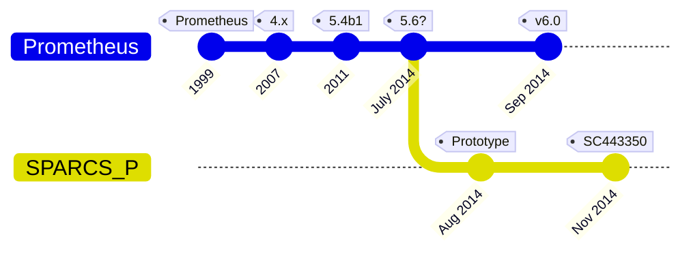
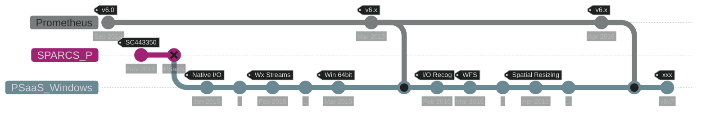
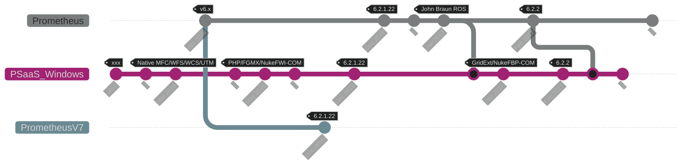
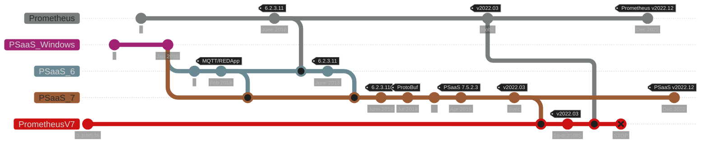
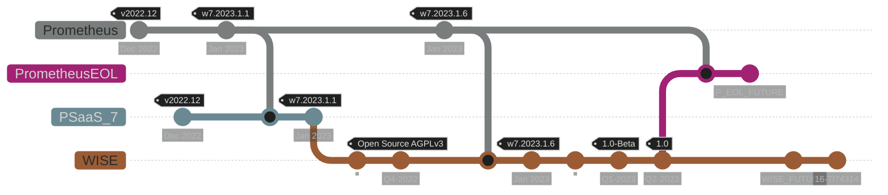

# Project Geneology

## Phase 1: 1999 - Nov 2014

```mermaid
%%{init: { 'gitGraph': { 'mainBranchName': 'Prometheus'}} }%%
gitGraph
commit id: "1999" tag: "Prometheus"
commit id: "2007" tag: "4.x"
commit id: "2011" tag: "5.4b1"
commit id: "July 2014" tag: "5.6?"

branch SPARCS_P
checkout SPARCS_P
commit id: "Aug 2014" tag: "Prototype"

checkout Prometheus
commit id: "Sep 2014" tag: "v6.0"

checkout SPARCS_P

commit id: "Nov 2014" tag: "SC443350"

```

## Phase 2: Sep 2014 - Apr 2016

```mermaid

%%{ init: {  
    'logLevel': 'debug', 
    'theme': 'dark', 
'gitGraph': { 'rotateCommitLabel': false, 'showBranches': true,  'showCommitLabel':true, 'mainBranchName': 'Prometheus' } } }%% 
gitGraph
branch SPARCS_P
checkout Prometheus
commit id: "Sep 2014" tag: "v6.0"
checkout SPARCS_P

commit id: "Nov 2014" tag: "SC443350"
commit id:"PSaaS" type:REVERSE

branch PSaaS_Windows
checkout PSaaS_Windows
commit id: "Jan  2015" tag: "Native I/O"
commit id: "."
commit id: "Feb 2015" tag: "Wx Streams"
commit id: ".."
commit id: "Mar 2015" tag: "Win 64bit"

checkout Prometheus
commit id: "Mar  2015" tag: "v6.x"
checkout PSaaS_Windows
merge Prometheus
commit id: "Feb 2016" tag:"I/O Recog"
commit id: "Mar 2016" tag: "WFS"
commit id: " ."
commit id: "Apr 2016" tag: "Spatial Resizing"
commit id: " .."
checkout Prometheus
commit id: "Apr  2016" tag: "v6.x"
checkout PSaaS_Windows
merge Prometheus
commit id:"v6v7" tag:"xxx"

```

## Phase 3: Mar 2016 - Feb 2017

```mermaid

%%{ init: {  
    'logLevel': 'debug', 
    'theme': 'dark', 
'gitGraph': { 'rotateCommitLabel': true, 'showBranches': true,  'showCommitLabel':true, 'mainBranchName': 'Prometheus' } } }%% 
gitGraph
branch PSaaS_Windows order:0
checkout PSaaS_Windows
commit id:"v6v7" tag:"xxx"
commit id: " . "
commit id: "Mar 2016" tag: "Native MFC/WFS/WCS/UTM"
checkout Prometheus
commit id: "Apr  2016" tag: "v6.x"
checkout PSaaS_Windows
commit id: "  .   "
commit id: "May 2016" tag: "PHP/FGMX/NukeFWI-COM"

commit id: "."
checkout Prometheus
branch PrometheusV7 order: 6
commit id: "Dec-2016" tag: "6.2.1.22"
checkout PSaaS_Windows
commit id: " Dec 2016" tag: "6.2.1.22"
checkout Prometheus
commit id: "Dec  2016" tag: "6.2.1.22"
commit id: ". "
commit id: "Jan 2017" tag: "John Braun ROS"
checkout PSaaS_Windows
merge Prometheus
commit id: "Jan  2017" tag: "GridExt/NukeFBP-COM"

checkout Prometheus
commit id: "Feb  2017" tag: "6.2.2"
checkout PSaaS_Windows
commit id: "Feb 2017" tag: "6.2.2"
merge Prometheus
commit id:"  .  "
checkout Prometheus
commit id:" .  "
```

## Phase 4: Feb 2017 - Dec 2022

```mermaid

%%{ init: {  
    'logLevel': 'debug', 
    'theme': 'dark', 
'gitGraph': { 'rotateCommitLabel': false, 'showBranches': true,  'showCommitLabel':true, 'mainBranchName': 'Prometheus' } } }%% 
gitGraph
branch PrometheusV7 order: 3
checkout PrometheusV7
commit
checkout Prometheus
branch PSaaS_Windows order:0
checkout PSaaS_Windows
commit id:"."

checkout Prometheus
commit id:". "
checkout PSaaS_Windows
commit id: "Jan 2018"

branch PSaaS_7 order: 2
branch PSaaS_6 order: 1
commit id:" . "
commit id: "Feb 2018" tag:"MQTT/REDApp"

checkout PSaaS_7
merge PSaaS_6


checkout Prometheus
commit id: "June 2018" tag: "6.2.3.11"

checkout PSaaS_6
merge Prometheus
commit id: " June 2018" tag: "6.2.3.11"
checkout PSaaS_7
merge PSaaS_6
commit id: "  June 2018" tag: "6.2.3.11"

checkout PSaaS_7
commit id: "Jul 2018" tag: "ProtoBuf"
commit id: "   .   .   "
commit id:"Apr 2019" tag: "PSaaS 7.5.2.3"
checkout PSaaS_6
commit id: "STOP" type: REVERSE

checkout Prometheus
commit id: "foob2" tag: "v2022.03"
checkout PSaaS_6

checkout PSaaS_7
commit id: "Sync " tag: "v2022.03"

checkout PrometheusV7
merge PSaaS_7
commit tag: "v2022.03"


merge Prometheus
commit id: "STOP" type:REVERSE

checkout Prometheus
commit id: "Dec  2022" tag: "Prometheus v2022.12"

checkout PSaaS_7
commit id: "Dec   2022" tag: "PSaaS v2022.12"


```

## Phase 5: Dec 2022 - 2023

```mermaid

%%{ init: {  
    'logLevel': 'debug', 
    'theme': 'dark', 
'gitGraph': { 'rotateCommitLabel': false, 'showBranches': true,  'showCommitLabel':true, 'mainBranchName': 'Prometheus' } } }%% 
gitGraph
branch PSaaS_7 order: 3


checkout Prometheus
commit id: "Dec 2022" tag: "v2022.12"
checkout PSaaS_7
commit id: "Dec  2022" tag: "v2022.12"


checkout Prometheus

commit id: "Jan  2023" tag: "w7.2023.1.1"
checkout PSaaS_7
merge Prometheus
commit id: "Jan 2023" tag: "w7.2023.1.1"
branch WISE order:4
checkout WISE
commit id: " "
commit id: "Q4-2022" tag:"Open Source AGPLv3"
checkout Prometheus
commit id: "Jan   2023" tag: "w7.2023.1.6"
checkout WISE
merge Prometheus
commit id: "Jan    2023" tag: "w7.2023.1.6"
commit id: "  "
commit id: "Q1-2023" tag:"1.0-Beta"
commit id: "Q2-2023" tag:"1.0"
branch PrometheusEOL order:2

merge Prometheus
commit id: "P_EOL_FUTURE"
checkout WISE
commit id: "WISE_FUTURE"
commit
```
