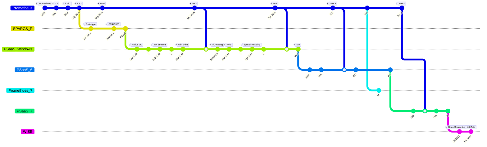

# Project (Prometheus -> WISE) Geneology

```mermaid
%%{init: { 'gitGraph': { 'mainBranchName': 'Prometheus'}} }%%
gitGraph
commit id: "1999" tag: "Prometheus"
commit id: "2007" tag: "4.x"
commit id: "2011" tag: "5.4b1"
commit id: "July 2014" tag: "5.6?"

branch SPARCS_P
checkout SPARCS_P
commit id: "Aug 2014" tag: "Prototype"

checkout Prometheus
commit id: "Sep 2014" tag: "v6.0"

checkout SPARCS_P

commit id: "Nov 2014" tag: "SC443350"
commit id:"PSaaS"


branch PSaaS_Windows
checkout PSaaS_Windows
commit id: "Jan  2015" tag: "Native I/O"
commit id: "."
commit id: "Feb 2015" tag: "Wx Streams"
commit id: ".."
commit id: "Mar 2015" tag: "Win 64bit"

checkout Prometheus
commit id: "Mar  2015" tag: "v6.x"
checkout PSaaS_Windows
merge Prometheus
commit id: "Feb 2016" tag:"I/O Recog"
commit id: "Mar 2016" tag: "WFS"
commit id: " ."
commit id: "Apr 2016" tag: "Spatial Resizing"
commit id: " .."
checkout Prometheus
commit id: "Apr  2016" tag: "v6.x"
checkout PSaaS_Windows
merge Prometheus
commit id:"v6v7" tag:"xxx"
branch PSaaS_6
commit id: "mmm"
commit id: "LLL"
checkout Prometheus
commit id: "bbb" tag: "xxxx.x"

checkout PSaaS_6
merge Prometheus
commit id: "ddd"
checkout Prometheus
commit id: "eee"

branch Promethues_7
checkout Promethues_7
commit id: "fff"
checkout PSaaS_6
commit id: "ccc"

checkout Prometheus
commit id: "foob2" tag: "wow2"
checkout PSaaS_6
branch PSaaS_7
checkout PSaaS_7
commit id: "ggg"

merge Prometheus
commit id: "hhh"
commit id: "iii"
branch WISE
checkout WISE
commit id: "Q4-2022" tag:"Open Source AGPLv3"
commit id: "Q1-2023" tag:"1.0-Beta"
```
